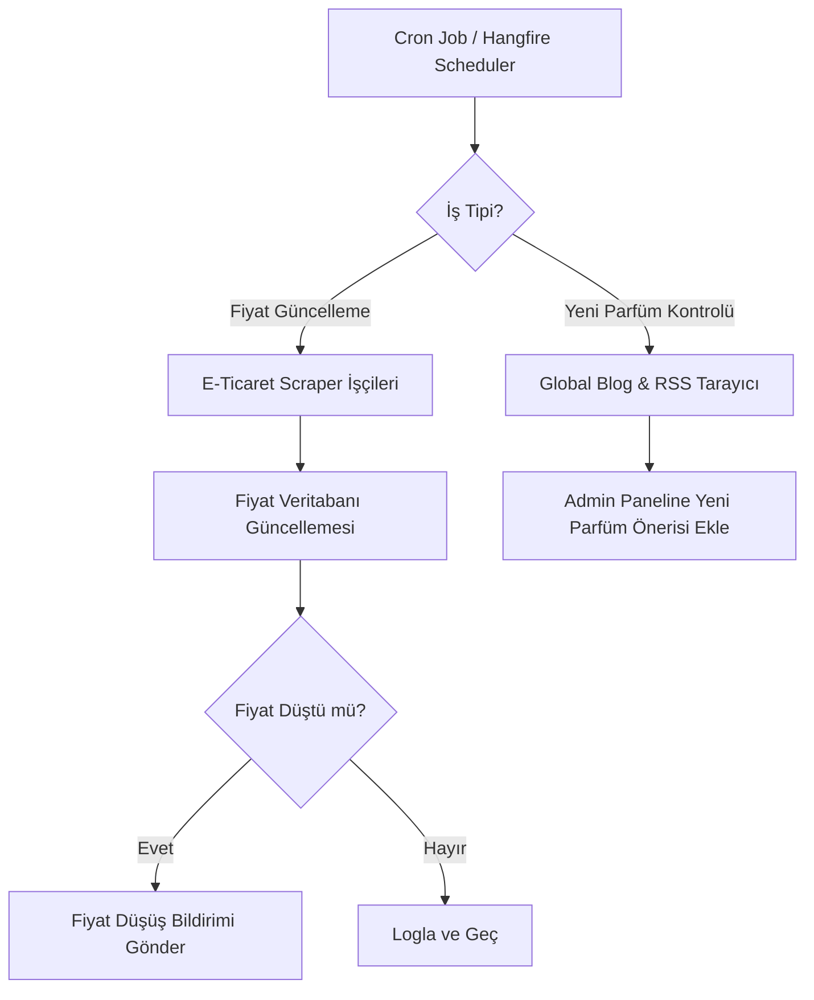

# Parfüm Karşılaştırma & Bilgi Platformu Proje Yol Haritası ve Teknik Şartnamesi

Bu doküman, Türkiye pazarını hedefleyen, arama motoru optimizasyonu (SEO) odaklı, parfümlerin özelliklerini sunan, kullanıcı yorumları barındıran, orijinal-muadil eşleştirmesi yapan ve alışveriş sitelerindeki anlık fiyatları karşılaştıran web uygulaması projesinin mimari, teknik ve işlevsel detaylarını içermektedir.

---

## 1. Mimari ve Altyapı Kararları

### Blazor vs. Next.js Analizi
Proje sahibi, frontend ve backend'i tek çatı altında geliştirebilmek adına **Blazor** teknolojisini değerlendirmektedir. Ancak uygulamanın başarısı tamamen organik arama trafiğine (SEO) bağlı olduğundan, bu konudaki kararın kritik önemi vardır.

| Kriter | Blazor WebAssembly | Blazor (SSR / Web App - .NET 8+) | Next.js (React / SSR & ISR) |
| :--- | :--- | :--- | :--- |
| **SEO Uyumluluğu** | ❌ Çok Kötü (Arama motorları JS/Wasm yüklenmeden boş sayfa görür) | ⚠️ Orta-İyi (Sunucu taraflı render mevcuttur ancak ekosistem SEO optimizasyon araçları kısıtlıdır) | 🚀 Mükemmel (Gelişmiş SSR, ISR ve SEO odaklı meta/head yönetimi mevcuttur) |
| **İlk Yükleme Hızı (LCP)**| ❌ Yavaş (Wasm runtime indirilmesi gerekir) | ⚠️ Orta (Sunucu yanıt süresine bağlıdır) | 🚀 Çok Hızlı (Edge caching ve statik üretim imkanları) |
| **Ekosistem ve UI Kütüphaneleri** | ⚠️ Kısıtlı (Bootstrap/Tailwind entegrasyonu var ancak modern interaktif kütüphaneler sınırlı) | ⚠️ Kısıtlı | 🚀 Sınırsız (Framer Motion, Swiper, modern grafik kütüphaneleri, headless bileşenler vb.) |
| **Geliştirme Hızı** | 🚀 Hızlı (C# tek dil) | 🚀 Hızlı (C# tek dil) | ⚠️ Orta (İki farklı dil/çerçeve öğrenme eğrisi) |

#### Karar ve Öneri: **Next.js (Frontend) + ASP.NET Core (.NET 8/9 Web API) + PostgreSQL (Database)**
SEO, Core Web Vitals (özellikle LCP ve INP) ve kullanıcı deneyimi bu projenin temel taşıdır. Bu nedenle:
1. **Frontend:** **Next.js** kullanılmalıdır. Parfüm detay sayfaları **ISR (Incremental Static Regeneration)** ile statik olarak sunulacaktır. Böylece sayfalar milisaniyeler içinde açılırken, arka planda belirli aralıklarla (örneğin 1 saatte bir) veya fiyat değiştiğinde tetikleme (On-demand revalidation) ile güncellenecektir.
2. **Backend:** **ASP.NET Core Web API** olarak yapılandırılacaktır. Bu sayede backend C# ile temiz bir şekilde geliştirilirken, PostgreSQL veritabanı yönetimi ve arka plan işleri (Hangfire ile scraping/veri güncelleme) güçlü bir şekilde yürütülecektir.

---

## 2. Kullanıcı Arayüzü (UI) ve UX Tasarımı

Parfüm, duyusal ve lüksü çağrıştıran bir niş alandır. Web sitesinin tasarımı bu hissiyatı yansıtmalıdır.

### Tasarım İlkeleri
*   **Duyusal Minimalizm (Sensory Minimalism):** Temiz, geniş beyaz alanlar (white space), yüksek kaliteli parfüm şişesi görselleri.
*   **Renk Paleti:** Sıcak bej tonları, amber/şampanya sarısı, derin kömür rengi (dark charcoal) ve altın/pirinç aksan detaylar. Açık/koyu mod seçeneği (Premium Dark Mode).
*   **Tipografi:** Başlıklarda lüks hissi veren modern Serif fontlar (örn. *Playfair Display*, *Cinzel* veya *Outfit*), gövde yazılarında ise okunabilirliği yüksek Sans-Serif fontlar (örn. *Inter*, *Roboto*).

### Kritik UI/UX Bileşenleri
1.  **Breadcrumb Hover Select (Kategori Seçim Listesi):**
    *   Kullanıcı breadcrumb üzerindeki bir kategoriye (örneğin *EDP* veya *Chanel* markası) hover ettiğinde, o hiyerarşideki alternatifleri barındıran şık, mikro-animasyonlu bir dropdown açılır.
    *   Örn: `EDP` üzerine gelince: `EDT`, `EDC`, `Extrait de Parfum`, `Cologne` seçenekleri listelenir ve hızlı geçiş sağlanır.
2.  **Koku Piramidi (Fragrance Pyramid):**
    *   Notaların (Üst, Orta, Dip) klasik bir piramit şemasında veya görsel olarak ayrıştırılmış kartlar halinde, tıklandığında ilgili notaya sahip diğer parfümleri listeleyecek şekilde tasarlanması.
3.  **Mevsim ve Yaş Grubu Görselleştiricisi:**
    *   Kullanıcı oylarıyla belirlenen mevsim (İlkbahar, Yaz, Sonbahar, Kış) ve yaş grubu (Genç, Orta Yaş, Olgun) dağılımını gösteren dairesel ilerleme çubukları veya minimalist bir radar grafik.
4.  **Fiyat Karşılaştırma Matrisi:**
    *   Farklı mağazalardaki fiyatların listelendiği, en ucuz seçeneğin yeşil etiketle öne çıkarıldığı, doğrudan yönlendiren "Mağazaya Git" butonları.

---

## 3. Detaylı SEO Planı

Arama motorlarından gelen organik trafik, projenin ana can damarıdır.

### Teknik SEO Kuralları
1.  **ISR (Incremental Static Regeneration):**
    *   Parfüm detay sayfaları ve marka sayfaları statik olarak derlenmeli, `next-sitemap` veya dinamik bir API ile her yeni parfüm veya blog yazısı eklendiğinde `sitemap.xml` anlık güncellenmelidir.
2.  **Schema.org Yapılandırılmış Veri (JSON-LD):**
    *   **Product Schema:** Parfüm adı, marka, resim, açıklama ve genel derecelendirme verileri.
    *   **AggregateRating Schema:** Kullanıcıların verdiği puanların ortalaması ve toplam oy sayısı (Arama sonuçlarında yıldızların çıkması için kritik).
    *   **BreadcrumbList Schema:** Google botlarının site yapısını anlaması için breadcrumb şeması.
    *   **FAQPage Schema:** Sıkça sorulan sorular (örn: "Dior Sauvage kalıcı mı?", "Bargello Sauvage kodu nedir?").
    *   **Article Schema:** Blog yazıları için yazar ve yayın tarihi bilgileri.
3.  **URL Yapısı (SEO Dostu):**
    *   *Parfüm Sayfası:* `/parfum/{marka-slug}/{parfum-slug}-{konsantrasyon}-{hacim}ml` (Örn: `/parfum/chanel/bleu-de-chanel-edp-100ml`)
    *   *Marka Sayfası:* `/marka/{marka-slug}` (Örn: `/marka/chanel`)
    *   *Karşılaştırma Sayfası:* `/karsilastir/{parfum-1-slug}-vs-{parfum-2-slug}` (Örn: `/karsilastir/creed-aventus-vs-club-de-nuit-intense`)

### İçeriksel SEO Stratejisi
*   **AI Yorum Özetleme (Benzersiz İçerik):** Google, birbirinin kopyası olan e-ticaret sayfalarını sevmez. Kullanıcılardan gelen 100 yorumu analiz eden ve *"Bu parfüm genellikle kış aylarında tercih ediliyor ve kalıcılığı 8 saatten fazla..."* şeklinde benzersiz bir özet oluşturan bir mekanizma, Google gözünde sayfayı eşsiz kılacaktır.
*   **Blog İçerikleri:** "2026 En İyi Erkek Parfümleri", "Yazın Kullanılabilecek Hafif Parfümler", "Parfüm Kalıcılığı Nasıl Artırılır?" gibi yüksek aranma hacimli konularda rehber yazılar.

---

## 4. Veri Toplama ve Eşleştirme (Scraping & Dupe Matching)

### Başlangıç Veri Setinin Toplanması
Sistem canlıya çıkmadan önce geniş bir parfüm kütüphanesine sahip olmalıdır.

1.  **Parfüm ve Nota Verisi:**
    *   Global parfüm veritabanlarından (Fragrantica, Parfumo) Python (Scrapy, Playwright) veya Node.js tabanlı crawler'lar aracılığıyla marka, parfüm, koku piramidi, cinsiyet ve piyasaya çıkış yılı bilgileri toplanır.
    *   *Yasal Uyarı:* Resimlerin telif haklarına dikkat edilmeli, mümkünse API'ler veya telifsiz/marka basın kiti görselleri kullanılmalı ya da AI tabanlı görsel geliştiriciler tercih edilmelidir.
2.  **Güncel Fiyat Verileri:**
    *   Trendyol, Hepsiburada, Boyner, Sephora, Sevil, Beymen, N11 sitelerindeki fiyatlar taranır.
    *   Barkod (EAN/UPC) eşleşmesi en güvenli yoldur. Ancak kozmetikte barkod her zaman açıkça paylaşılmadığı için "Marka Adı + Parfüm Adı + Konsantrasyon + Hacim (ml)" kombinasyonları ile metin benzerliği (Levensthein veya Jaro-Winkler algoritmaları) kullanılarak eşleme yapılır.
3.  **Muadil (Inspired) Ürün Eşlemesi:**
    *   Türkiye pazarında popüler olan muadil üreticileri (Bargello, Muscent, Mad, David Walker, Sansiro, Tutaste) taranır.
    *   Bu firmaların sitelerinde orijinal parfümlerin kod karşılıkları bulunur (Örn: Mad C101 -> Creed Aventus). Bu veriler bir kereye mahsus scraper veya manuel veri girişi ile toplanıp `perfume_dupes` tablosunda eşleştirilir.

---

## 5. Veri Güncelleme ve Bakım (Data Maintenance)

Verilerin güncel kalması kullanıcı güveni için şarttır.



### Bakım Mekanizmaları
1.  **Fiyat Güncelleme Frekansı:**
    *   En çok aranan ve tıklanan popüler 500 parfümün fiyatları günde 1 kez güncellenir.
    *   Daha az popüler parfümler haftada 1 kez taranır.
    *   Trendyol/Hepsiburada gibi platformlarda API erişimi veya merchant XML entegrasyonu varsa önceliklendirilir.
2.  **Yeni Çıkan Parfümler:**
    *   Global parfüm lansman siteleri ve RSS beslemeleri haftalık taranarak yeni parfümler tespit edilir ve admin onayına sunulur.
3.  **Fiyatı Düşünce Haber Ver:**
    *   Kullanıcı bir parfümün belirli bir fiyata veya mevcut fiyatın %X altına inmesini talep edebilir.
    *   Hangfire background worker fiyat güncellemesini kaydettiğinde, alarm kuran kullanıcıları kontrol eder ve tetiklenenlere e-posta (Resend/SendGrid) veya Web Push bildirimi gönderir.

---

## 6. İlişkisel Veritabanı Şeması (PostgreSQL Schema)

Veritabanı ilişkisel bütünlüğü ve performansı korumak için tasarlanmıştır.

```sql
-- 1. Markalar Tablosu
CREATE TABLE brands (
    id SERIAL PRIMARY KEY,
    name VARCHAR(100) NOT NULL,
    slug VARCHAR(120) UNIQUE NOT NULL,
    logo_url TEXT,
    is_alternative BOOLEAN DEFAULT FALSE, -- Muadil marka mı? (örn. Bargello)
    description TEXT,
    created_at TIMESTAMP DEFAULT CURRENT_TIMESTAMP
);

-- 2. Parfümler Tablosu
CREATE TABLE perfumes (
    id SERIAL PRIMARY KEY,
    brand_id INT REFERENCES brands(id) ON DELETE CASCADE,
    name VARCHAR(150) NOT NULL,
    slug VARCHAR(180) UNIQUE NOT NULL,
    description TEXT,
    gender VARCHAR(10) CHECK (gender IN ('Male', 'Female', 'Unisex')),
    release_year INT,
    concentration VARCHAR(20), -- EDP, EDT, EDC, Extrait, vb.
    image_url TEXT,
    created_at TIMESTAMP DEFAULT CURRENT_TIMESTAMP
);

-- 3. Notalar Tablosu
CREATE TABLE notes (
    id SERIAL PRIMARY KEY,
    name VARCHAR(80) NOT NULL,
    slug VARCHAR(100) UNIQUE NOT NULL,
    description TEXT,
    image_url TEXT
);

-- 4. Parfüm - Nota İlişki Tablosu (Koku Piramidi)
CREATE TABLE perfume_notes (
    perfume_id INT REFERENCES perfumes(id) ON DELETE CASCADE,
    note_id INT REFERENCES notes(id) ON DELETE CASCADE,
    note_type VARCHAR(10) CHECK (note_type IN ('Top', 'Middle', 'Base')),
    PRIMARY KEY (perfume_id, note_id, note_type)
);

-- 5. Muadil Eşleşme Tablosu
CREATE TABLE perfume_dupes (
    id SERIAL PRIMARY KEY,
    original_perfume_id INT REFERENCES perfumes(id) ON DELETE CASCADE,
    alternative_perfume_id INT REFERENCES perfumes(id) ON DELETE CASCADE,
    match_confidence DECIMAL(3,2) DEFAULT 1.00, -- Yapay zeka veya manuel güven skoru
    notes TEXT, -- Eşleşmeye dair ek açıklama
    created_at TIMESTAMP DEFAULT CURRENT_TIMESTAMP,
    CONSTRAINT unique_dupe_pair UNIQUE(original_perfume_id, alternative_perfume_id)
);

-- 6. Satıcılar Tablosu
CREATE TABLE retailers (
    id SERIAL PRIMARY KEY,
    name VARCHAR(80) NOT NULL,
    website_url TEXT,
    logo_url TEXT
);

-- 7. Anlık Fiyatlar Tablosu
CREATE TABLE perfume_prices (
    id SERIAL PRIMARY KEY,
    perfume_id INT REFERENCES perfumes(id) ON DELETE CASCADE,
    retailer_id INT REFERENCES retailers(id) ON DELETE CASCADE,
    price DECIMAL(10,2) NOT NULL,
    product_url TEXT NOT NULL,
    in_stock BOOLEAN DEFAULT TRUE,
    updated_at TIMESTAMP DEFAULT CURRENT_TIMESTAMP
);

-- 8. Kullanıcılar Tablosu (Google Auth & Sosyal Kayıt için)
CREATE TABLE users (
    id SERIAL PRIMARY KEY,
    email VARCHAR(150) UNIQUE NOT NULL,
    display_name VARCHAR(100),
    avatar_url TEXT,
    provider VARCHAR(20) DEFAULT 'google',
    provider_id TEXT UNIQUE,
    is_admin BOOLEAN DEFAULT FALSE,
    created_at TIMESTAMP DEFAULT CURRENT_TIMESTAMP
);

-- 9. Yorumlar ve Puanlar Tablosu
CREATE TABLE comments (
    id SERIAL PRIMARY KEY,
    perfume_id INT REFERENCES perfumes(id) ON DELETE CASCADE,
    user_id INT REFERENCES users(id) ON DELETE CASCADE,
    rating INT CHECK (rating BETWEEN 1 AND 5),
    content TEXT,
    is_approved BOOLEAN DEFAULT FALSE,
    created_at TIMESTAMP DEFAULT CURRENT_TIMESTAMP
);

-- 10. AI Analiz Özetleri Tablosu
CREATE TABLE ai_summaries (
    id SERIAL PRIMARY KEY,
    perfume_id INT REFERENCES perfumes(id) ON DELETE CASCADE UNIQUE,
    summary_text TEXT NOT NULL,
    longevity_rating VARCHAR(30), -- Örn: "8-10 Saat (Çok Yüksek)"
    projection_rating VARCHAR(30), -- Örn: "Fark edilebilir (Orta)"
    updated_at TIMESTAMP DEFAULT CURRENT_TIMESTAMP
);

-- 11. Fiyat Düşüşü Alarmları Tablosu
CREATE TABLE price_alerts (
    id SERIAL PRIMARY KEY,
    user_id INT REFERENCES users(id) ON DELETE CASCADE,
    perfume_id INT REFERENCES perfumes(id) ON DELETE CASCADE,
    target_price DECIMAL(10,2) NOT NULL,
    is_active BOOLEAN DEFAULT TRUE,
    created_at TIMESTAMP DEFAULT CURRENT_TIMESTAMP
);

-- 12. Favoriler Tablosu
CREATE TABLE favorites (
    user_id INT REFERENCES users(id) ON DELETE CASCADE,
    perfume_id INT REFERENCES perfumes(id) ON DELETE CASCADE,
    PRIMARY KEY (user_id, perfume_id)
);

-- 13. Blog Yazıları Tablosu
CREATE TABLE blog_posts (
    id SERIAL PRIMARY KEY,
    title VARCHAR(200) NOT NULL,
    slug VARCHAR(220) UNIQUE NOT NULL,
    content TEXT NOT NULL,
    author_id INT REFERENCES users(id),
    is_approved BOOLEAN DEFAULT FALSE,
    created_at TIMESTAMP DEFAULT CURRENT_TIMESTAMP,
    updated_at TIMESTAMP DEFAULT CURRENT_TIMESTAMP
);
```

---

## 7. Para Kazanma Modeli (Monetization)

Kullanıcıyı siteden kaçırmayacak ve gelir üretecek modeller şunlardır:

1.  **Gelir Ortaklığı (Affiliate Marketing) - Temel Gelir Kaynağı:**
    *   Trendyol, Hepsiburada, Boyner, N11 gibi platformların gelir ortaklığı programlarına (Affiliate) üye olunur.
    *   Fiyat karşılaştırma listesindeki linkler affiliate parametresi içerir. Kullanıcı site üzerinden gidip alışveriş yaptığında %2 ila %10 arasında komisyon kazanılır.
2.  **Muadil Marka Sponsorlukları & Direct-to-Consumer (D2C) Yönlendirmeleri:**
    *   Mad, Muscent, Bargello gibi markalarla anlaşmalar yapılarak, orijinal parfümlerin altındaki "Muadil Seçenekler" alanında en üst sırada sponsorlu listeleme hakkı satılır.
    *   Örn: "Muscent Alternatifi (Sponsorlu)" butonu ile doğrudan Muscent'in kendi sitesindeki satın alma sayfasına yönlendirme yapılır ve tıklama başına veya satış komisyonu üzerinden ücretlendirilir.
3.  **Google AdSense ve Native Reklamlar:**
    *   Arayüzün premium hissiyatını bozmayacak şekilde, blog yazılarında ve arama listeleme sayfalarında (örneğin her 10 parfümde bir) doğal reklam alanları oluşturulur. Pop-up veya ekranı kaplayan agresif reklam modellerinden kesinlikle kaçınılmalıdır.
4.  **Premium Listeleme (Butik/Niş Türk Markaları):**
    *   Türkiye'deki niş/butik yerli parfüm üreticilerine (örn. Nishane benzeri butik markalar) ürünlerini öne çıkarma, özel lansman sayfaları oluşturma ve kullanıcılara doğrudan numune (sample) satış linkleri sunma imkanı sağlanır.

---

## 8. Detaylı Yol Haritası ve Fazlar

Projenin geliştirilme süreci 6 faza ayrılmıştır.

```
┌────────────────────────────────────────────────────────┐
│ FAZ 1: Hazırlık, DB & Mimari Kurulum (Hafta 1-2)       │
└───────────────────────────┬────────────────────────────┘
                            ▼
┌────────────────────────────────────────────────────────┐
│ FAZ 2: Crawling & Veri Toplama Pipelines (Hafta 3-4)   │
└───────────────────────────┬────────────────────────────┘
                            ▼
┌────────────────────────────────────────────────────────┐
│ FAZ 3: Backend API & Arama Motoru Entegrasyonu (H5-6)  │
└───────────────────────────┬────────────────────────────┘
                            ▼
┌────────────────────────────────────────────────────────┐
│ FAZ 4: Next.js Frontend & UI Geliştirme (Hafta 7-9)    │
└───────────────────────────┬────────────────────────────┘
                            ▼
┌────────────────────────────────────────────────────────┐
│ FAZ 5: SEO Optimizasyonu, AI Özetleme & Testler (H10-11)│
└───────────────────────────┬────────────────────────────┘
                            ▼
┌────────────────────────────────────────────────────────┐
│ FAZ 6: Canlıya Geçiş & Pazarlama / Gelir Ortaklığı (H12+)│
└────────────────────────────────────────────────────────┘
```

### Faz 1: Hazırlık ve Altyapı Kurulumu (Hafta 1-2)
*   Veritabanı tasarımı ve PostgreSQL kurulumu.
*   ASP.NET Core Web API projesinin kurulması ve temel katmanların (Entity Framework Core, JWT Auth) oluşturulması.
*   Next.js projesinin SEO dostu yapılandırma ile kurulması.

### Faz 2: Crawling ve Veri Toplama (Hafta 3-4)
*   Python (Scrapy) ile global kütüphanelerden parfüm temel verilerinin (marka, adı, notalar) çekilerek veritabanına aktarılması.
*   Türkiye e-ticaret siteleri için ilk fiyat tarama scriptlerinin yazılması.
*   Muadil parfüm kodlarının taranması ve veri tabanına işlenmesi.

### Faz 3: Backend API ve Arama (Hafta 5-6)
*   Arama motoru entegrasyonu (PostgreSQL FTS veya Meilisearch). Instant search API'sinin yazılması.
*   Yorum yazma, puanlama, favorilere ekleme ve karşılaştırma listesi API uçlarının yazılması.
*   Hangfire background worker entegrasyonu (günlük fiyat çekim scheduler'ı).

### Faz 4: Frontend Geliştirme (Hafta 7-9)
*   Next.js ile responsive arayüz kodlaması (Premium Dark/Light theme).
*   Koku Piramidi, Mevsim/Yaş Radarı, Breadcrumb Hover dropdown gibi kritik UI elemanlarının geliştirilmesi.
*   Fiyat karşılaştırma matrisinin ve muadil ürün linklerinin frontend tarafında sunulması.
*   Google Login entegrasyonunun tamamlanması.

### Faz 5: SEO Optimizasyonu ve AI Özellikleri (Hafta 10-11)
*   SEO meta tagleri, dinamik sitemap.xml ve Schema.org JSON-LD entegrasyonlarının yapılması.
*   Kullanıcı yorumlarını analiz edip özet çıkaran AI pipeline'ının (Gemini API entegrasyonu) kurulması.
*   "Fiyatı Düşünce Haber Ver" e-posta gönderim mekanizmasının test edilmesi.

### Faz 6: Canlıya Geçiş ve Monetizasyon (Hafta 12+)
*   Üretim ortamına dağıtım (Vercel + AWS/DigitalOcean VPS).
*   Affiliate linklerinin sisteme entegre edilmesi.
*   Google AdSense başvurularının yapılması.
*   İlk kullanıcı trafiğini çekmek için blog içeriklerinin yayınlanması ve sosyal medya tanıtımları.
